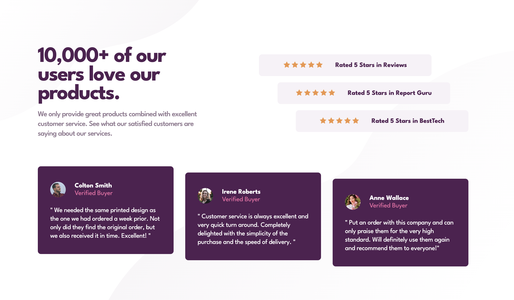

# Social proof section

## Table of contents
 
 - [Overview](#overview)
   - [Screenshot](#screenshot)
   - [Links](#links)
 - [My process](#my-process)
   - [Built with](#built-with)
 - [Author](#author)
 
 ## Overview
 
 ### Screenshot
 
 
 
 ### Links
 
 - Solution URL: [Solution URL](https://github.com/kisu-seo/social_proof_section)
 - Live Site URL: [Live URL](https://kisu-seo.github.io/social_proof_section/)
 
 ## My process
 
 ### Built with
 
 - Semantic HTML5 markup
 - CSS custom properties
 - Flexbox
 - Mobile-first workflow
 
 ## Author
 
 - Website - [Danny Seo](https://github.com/kisu-seo)
 - Frontend Mentor - [@kisu-seo](https://www.frontendmentor.io/profile/kisu-seo)